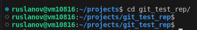
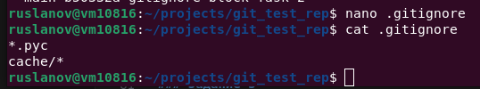
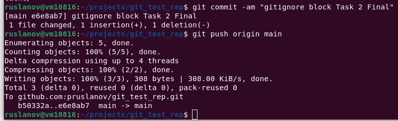
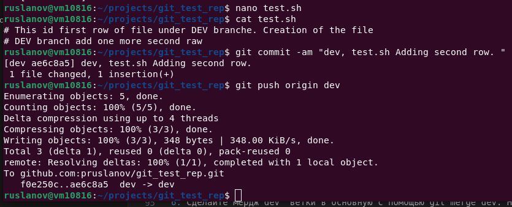

# Домашнее задание к занятию «Git»
## Выполнил: Русланов Петр
## Курс: FOPS-11 (CICD-20) 

---

### Задание 1

**Что нужно сделать:**

1. Зарегистрируйте аккаунт на [GitHub](https://github.com/).
2. Создайте  **новый отдельный публичный репозиторий**. Обязательно поставьте галочку в поле «Initialize this repository with a README».

3. Склонируйте репозиторий, используя https протокол `git clone ...`.

4. Перейдите в каталог с клоном репозитория.

5. Произведите первоначальную настройку Git, указав своё настоящее имя и email: `git config --global user.name` и `git config --global user.email johndoe@example.com`.
6. Выполните команду `git status` и запомните результат.

7. Отредактируйте файл README.md любым удобным способом, переведя файл в состояние Modified.
8. Ещё раз выполните `git status` и продолжайте проверять вывод этой команды после каждого следующего шага.

9. Посмотрите изменения в файле README.md, выполнив команды `git diff` и `git diff --staged`.

10. Переведите файл в состояние staged или, как говорят, добавьте файл в коммит, командой `git add README.md`.

11. Ещё раз выполните команды `git diff` и `git diff --staged`.

12. Теперь можно сделать коммит `git commit -m 'First commit'`.

13. Сделайте `git push origin master`.

В качестве ответа добавьте ссылку на этот коммит в ваш md-файл с решением.

[Ссылка на коммит](https://github.com/pruslanov/git_test_rep/commit/ed32e381e76cf87b5a8a443a82f61d79021f6036)

---

### Задание 2

**Что нужно сделать:**

1. Создайте файл .gitignore (обратите внимание на точку в начале файла) и проверьте его статус сразу после создания.

2. Добавьте файл .gitignore в следующий коммит `git add...`.

3. Напишите правила в этом файле, чтобы игнорировать любые файлы `.pyc`, а также все файлы в директории `cache`.

4. Сделайте коммит и пуш.

В качестве ответа добавьте ссылку на этот коммит в ваш md-файл с решением.

[Ссылка на коммит](https://github.com/pruslanov/git_test_rep/commit/e6e8ab70535f571d6132bee9456221d6d5e7b4bb)

---

### Задание 3

**Что нужно сделать:**

1. Создайте новую ветку dev и переключитесь на неё.

2. Создайте в ветке dev файл test.sh с произвольным содержимым.
3. Сделайте несколько коммитов и пушей  в ветку dev, имитируя активную работу над  файлом в процессе разработки.

4. Переключитесь на основную ветку.
5. Добавьте файл main.sh в основной ветке с произвольным содержимым, сделайте комит и пуш . Так имитируется продолжение общекомандной разработки в основной ветке во время разработки отдельного функционала в dev  ветке.

`git checkout main`

6. Сделайте мердж dev ветки в основную с помощью git merge dev. Напишите осмысленное сообщение в появившееся окно комита.

7. Сделайте пуш в основной ветке.
8. Не удаляйте ветку dev.

В качестве ответа прикрепите ссылку на граф коммитов https://github.com/ваш-логин/ваш-репозиторий/network в ваш md-файл с решением.

Ваш граф комитов должен выглядеть аналогично скриншоту:   

---
## Дополнительные задания* (со звёздочкой)

Их выполнение необязательное и не влияет на получение зачёта по домашнему заданию. Можете их решить, если хотите лучше разобраться в материале.

---
### Задание 4*

Сэмулируем конфликт. Перед выполнением изучите [документацию](https://git-scm.com/book/ru/v2/%D0%98%D0%BD%D1%81%D1%82%D1%80%D1%83%D0%BC%D0%B5%D0%BD%D1%82%D1%8B-Git-%D0%9F%D1%80%D0%BE%D0%B4%D0%B2%D0%B8%D0%BD%D1%83%D1%82%D0%BE%D0%B5-%D1%81%D0%BB%D0%B8%D1%8F%D0%BD%D0%B8%D0%B5).

**Что нужно сделать:**

1. Создайте ветку conflict и переключитесь на неё.
2. Внесите изменения в файл test.sh. 
3. Сделайте коммит и пуш.
4. Переключитесь на основную ветку.
5. Измените ту же самую строчку в файле test.sh.
6. Сделайте коммит и пуш.
7. Сделайте мердж ветки conflict в основную ветку и решите конфликт так, чтобы в результате в файле оказался код из ветки conflict.

В качестве ответа на задание прикрепите ссылку на граф коммитов https://github.com/ваш-логин/ваш-репозиторий/network в ваш md-файл с решением.